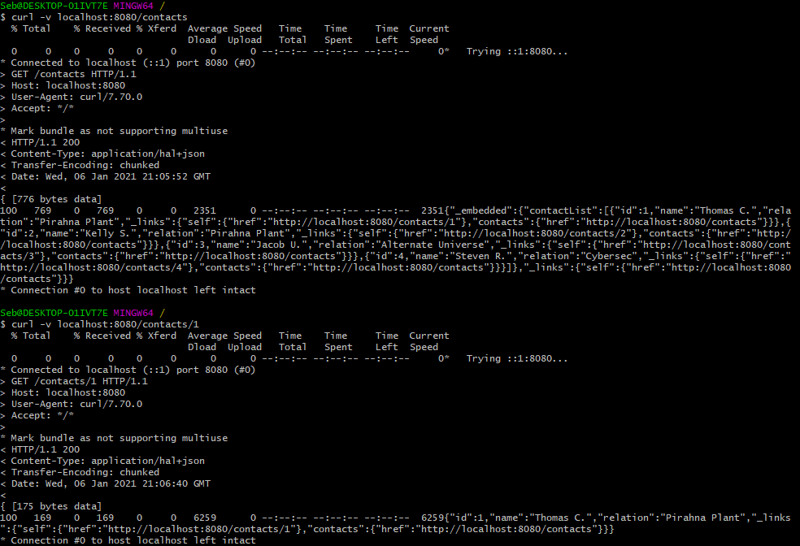

# ContactAPI
This is a project I made in order to practice my skills developing RESTful API's with Spring. 

This API allows users (usually me) to get information about contacts stored on the local H2A DB. This API also utilizes caching in order to boost performance through caching recent contacts. This API is built with the REST Styles and technicalities kept in mind and heavily utilizes functional programming to create efficient and concise code.  I used the Spring MVC framework in order to process objects and handle responses while working with the HTTP Layer. Each response not only gives the information but also will generate links to the other appropriate resources within the system.

Paths

### GET ###

/contacts
/contacts/{id}

### POST ###

/contacts

### PUT ###

/contacts/{id}

### DELETE ###

/contacts/{id}

